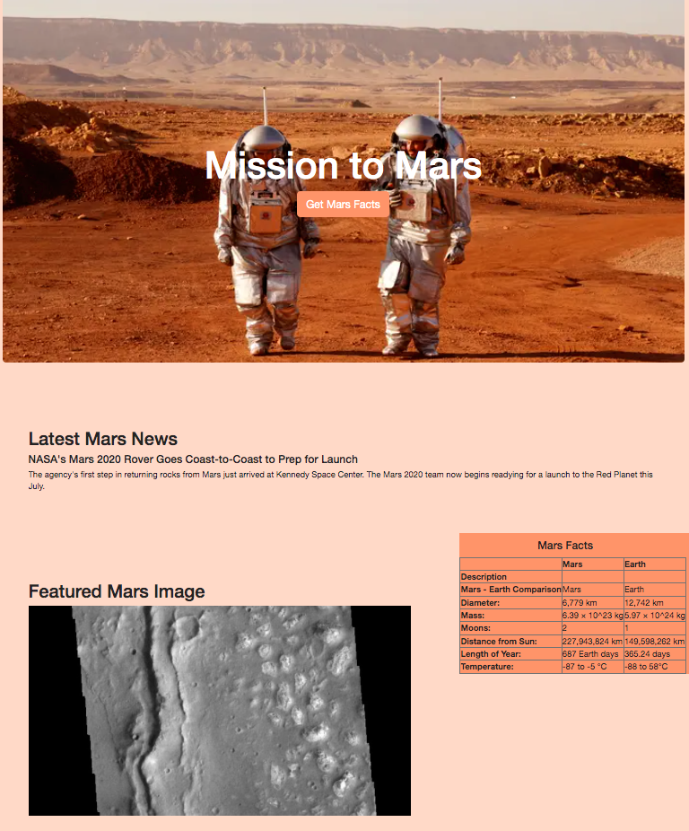
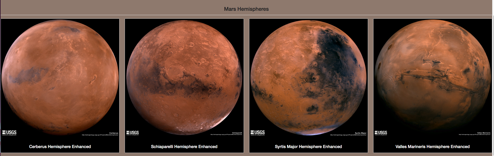
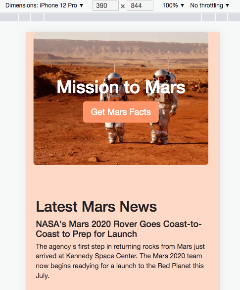

# Mission to Mars
## Project Overview 
This project will utilize web scrapping to get the latest news and updates with the click of a button. In order to scrape data, I used Splinter to automate a web browser, BeautifuSoup and Pandas to parse and extract the data, and MongoDB to hold all the data that had been gathered. I scraped 5 different webpages related to Mars and displayed the reuslts on a webpage.
## Results 
### Scraping the Data
#### Latest Mars News:
- Visit and scrape the Mars NASA news site to collect the lastest news title and artilce paragraph text using Splinter

#### Featured Mars Image:
- Visit "https://spaceimages-mars.com" and use Splinter to find the relative image URL
- Use the base URL that we collected to create an absolute URL string for the featured image

#### Mars Facts:
- Use pandas to scrape the table on "https://galaxyfacts-mars.com" that contains Mars facts and input the scarped data into a DataFrame
- Use pandas again to convert the DataFrame into a HTML string

#### Mars Hemispheres: 
- Visit the site that holds high resolution images of Mars hemispheres
- Create a list to hold the images and titles (hemisphere_image_urls)
- Write a for loop to browse through each article and retrieve the image URLs and titles for each hempisphere 
- Store the image URl string for the hempisphere image and the hemisphere title in a Python dictionary
- Append the list we created (hemisphere_image_urls) to include the hemisphere dictionary.

		# 2. Create a list to hold the images and titles.
		hemisphere_image_urls = []

		# 3. Write code to retrieve the image urls and titles for each hemisphere.
		for items in range(4):
    		# Browse through each article
    		browser.links.find_by_partial_text('Hemisphere')[items].click()
    
    		# Parse the HTML
   	 		html = browser.html
    		hemi_soup = soup(html,'html.parser')
    
    		# Scraping
    		title = hemi_soup.find('h2', class_='title').text
    		img_url = hemi_soup.find('li').a.get('href')
    
    		# Store findings into a dictionary and append to list
    		hemispheres = {}
    		hemispheres['img_url'] = f'https://marshemispheres.com/{img_url}'
    		hemispheres['title'] = title
    		hemisphere_image_urls.append(hemispheres)
    
    		# Back to repeat
    		browser.back()
    
		# Quit the browser
		browser.quit()

### MongoDB and Flask
- Start MongoDB and run Flask application to display that information that was scarped into a HTML page
- Export Jupyter Notebook as a Python scripy, scraping.py, and add a new method named "scrape_all" that will run all scraping functions and store results into a dictionary
- In the app.py, /scrape creates a route that will import the scraping.py script and call scrape_all function
- The results from above are stored in MongoDB as a dictionary
- Create a root route ("/") that will navigate MongoDB and return the Mars data into a HTML template
- index.html will read the Mars dictionary and display all the data in the appropriate manner
- The Mars Facts page is also created to be mobile repsonsive and includes multiple Bootstrap 3 components

			
